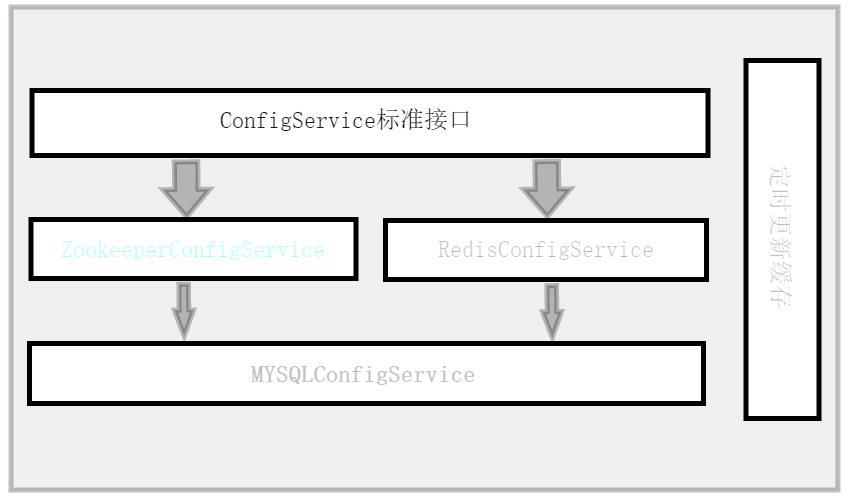

# dictator

中心化的配置管理组件。建立这个项目是为了解决同一公司多个项目多个环境配置不统一、修改麻烦的问题。

### 特性

- [x] 中心化配置

- [x] Spring/Spring Boot集成

- [ ] web管理界面

- [x] JDK8+

### 架构设计

项目开发中，如果你正好遇到同样的场景需要处理，欢迎直接提交issue/PR或者直接联系作者QQ:791411860

### License

dictator 是一个使用[MIT协议](LICENSE)的开源项目