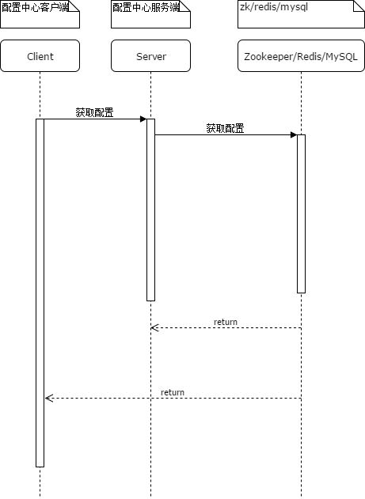
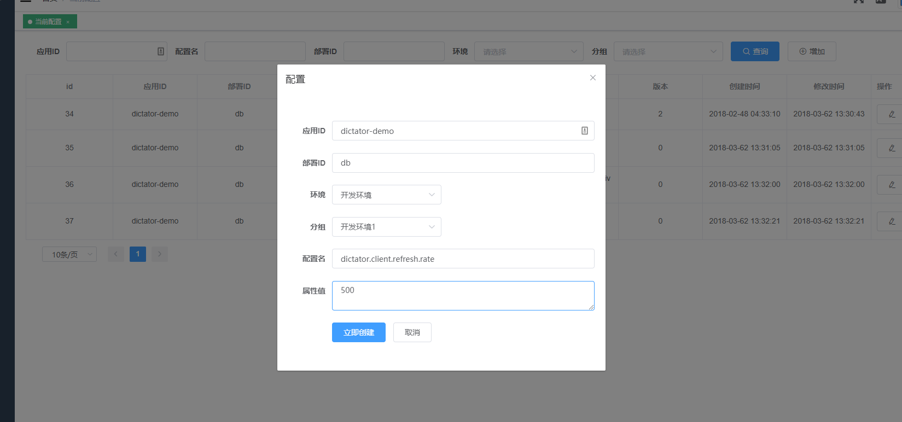

# 设计机制

## 基本思路

客户端是配置的使用者，服务端是提供者。zk/redis/mysql是配置的持久化提供者



client通过http协议请求server，server先检查缓存提供者（zk/redis）是否存在，不存在就用默认提供的MySQL实现获取配置。
为了防止客户端请求频率过快，穿透缓存，dictator采用定时刷新的方式同步数据库和缓存的配置数据

## 服务端
### 基本配置
### 配置历史
### 分组

## 客户端
### 客户端标识

由于服务端只是配置的提供者，并不知道客户端需要的配置都是那些，dictator要求客户端需要配置
```properties
appId=app #应用ID代码
profile=dev #环境代码（开发环境、测试环境、生产环境）
serverUrl=http://localhost:3399 #dictator服务端的地址
```
>serverUrl、appId和profile都是客户端必须的配置。

### 拉取策略

为了稳定的提供服务，dictator使用HTTP协议定时拉取配置，默认频率是1S每次。客户端在请求时加入参数上一次成功同步配置的时间毫秒数，服务端按照时间对比，只返回上次同步之后新增的配置。

### 配置刷新

如果你需要修改频率，可以登录配置中心管理台增加配置


>dictator在spring启动时就已经注入配置，所以我们可以在配置中心管理Spring的所有配置，包括客户端本身！


### 为什么不是eureka
```
[INFO] \- com.netflix.eureka:eureka-core:jar:1.9.0:runtime
[INFO]    +- com.netflix.eureka:eureka-client:jar:1.9.0:runtime
[INFO]    |  +- org.codehaus.jettison:jettison:jar:1.3.7:runtime
[INFO]    |  |  \- stax:stax-api:jar:1.0.1:runtime
[INFO]    |  +- com.netflix.netflix-commons:netflix-eventbus:jar:0.3.0:runtime
[INFO]    |  |  +- org.slf4j:slf4j-api:jar:1.6.4:runtime
[INFO]    |  |  +- com.netflix.netflix-commons:netflix-infix:jar:0.3.0:runtime
[INFO]    |  |  |  +- commons-jxpath:commons-jxpath:jar:1.3:runtime
[INFO]    |  |  |  +- org.antlr:antlr-runtime:jar:3.4:runtime
[INFO]    |  |  |  |  +- org.antlr:stringtemplate:jar:3.2.1:runtime
[INFO]    |  |  |  |  \- antlr:antlr:jar:2.7.7:runtime
[INFO]    |  |  |  \- com.google.code.gson:gson:jar:2.1:runtime
[INFO]    |  |  \- org.apache.commons:commons-math:jar:2.2:runtime
[INFO]    |  +- com.netflix.archaius:archaius-core:jar:0.7.6:runtime
[INFO]    |  |  +- com.google.code.findbugs:jsr305:jar:3.0.1:runtime
[INFO]    |  |  +- commons-configuration:commons-configuration:jar:1.8:runtime
[INFO]    |  |  |  \- commons-lang:commons-lang:jar:2.6:runtime
[INFO]    |  |  \- com.google.guava:guava:jar:16.0:runtime
[INFO]    |  +- com.netflix.servo:servo-core:jar:0.12.21:runtime
[INFO]    |  +- com.sun.jersey:jersey-core:jar:1.19.1:runtime
[INFO]    |  +- com.sun.jersey:jersey-client:jar:1.19.1:runtime
[INFO]    |  +- com.sun.jersey.contribs:jersey-apache-client4:jar:1.19.1:runtime
[INFO]    |  +- org.apache.httpcomponents:httpclient:jar:4.5.3:runtime
[INFO]    |  |  +- org.apache.httpcomponents:httpcore:jar:4.4.6:runtime
[INFO]    |  |  \- commons-codec:commons-codec:jar:1.9:runtime
[INFO]    |  +- com.google.inject:guice:jar:4.1.0:runtime
[INFO]    |  |  +- javax.inject:javax.inject:jar:1:runtime
[INFO]    |  |  \- aopalliance:aopalliance:jar:1.0:runtime
[INFO]    |  +- com.github.vlsi.compactmap:compactmap:jar:1.2.1:runtime
[INFO]    |  |  \- com.github.andrewoma.dexx:dexx-collections:jar:0.2:runtime
[INFO]    |  +- com.fasterxml.jackson.core:jackson-annotations:jar:2.9.4:runtime
[INFO]    |  +- com.fasterxml.jackson.core:jackson-core:jar:2.9.4:runtime
[INFO]    |  \- com.fasterxml.jackson.core:jackson-databind:jar:2.9.4:runtime
[INFO]    +- com.amazonaws:aws-java-sdk-core:jar:1.11.277:runtime
[INFO]    |  +- commons-logging:commons-logging:jar:1.1.3:runtime
[INFO]    |  +- software.amazon.ion:ion-java:jar:1.0.2:runtime
[INFO]    |  +- com.fasterxml.jackson.dataformat:jackson-dataformat-cbor:jar:2.6.7:runtime
[INFO]    |  \- joda-time:joda-time:jar:2.8.1:runtime
[INFO]    +- com.amazonaws:aws-java-sdk-ec2:jar:1.11.277:runtime
[INFO]    |  \- com.amazonaws:jmespath-java:jar:1.11.277:runtime
[INFO]    +- com.amazonaws:aws-java-sdk-autoscaling:jar:1.11.277:runtime
[INFO]    +- com.amazonaws:aws-java-sdk-sts:jar:1.11.277:runtime
[INFO]    +- com.amazonaws:aws-java-sdk-route53:jar:1.11.277:runtime
[INFO]    +- javax.servlet:servlet-api:jar:2.5:runtime
[INFO]    +- com.thoughtworks.xstream:xstream:jar:1.4.10:runtime
[INFO]    |  +- xmlpull:xmlpull:jar:1.1.3.1:runtime
[INFO]    |  \- xpp3:xpp3_min:jar:1.1.4c:runtime
[INFO]    +- javax.ws.rs:jsr311-api:jar:1.1.1:runtime
[INFO]    +- com.fasterxml.jackson.dataformat:jackson-dataformat-xml:jar:2.9.4:runtime
[INFO]    |  +- com.fasterxml.jackson.module:jackson-module-jaxb-annotations:jar:2.9.4:runtime
[INFO]    |  +- org.codehaus.woodstox:stax2-api:jar:3.1.4:runtime
[INFO]    |  \- com.fasterxml.woodstox:woodstox-core:jar:5.0.3:runtime
[INFO]    \- org.codehaus.woodstox:woodstox-core-asl:jar:4.4.1:runtime
[INFO]       \- javax.xml.stream:stax-api:jar:1.0-2:runtime
```