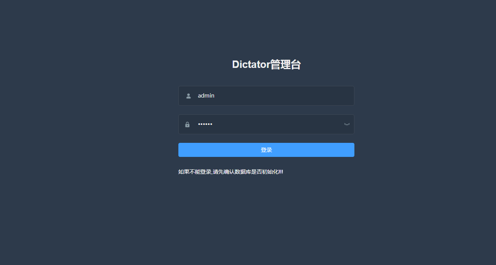
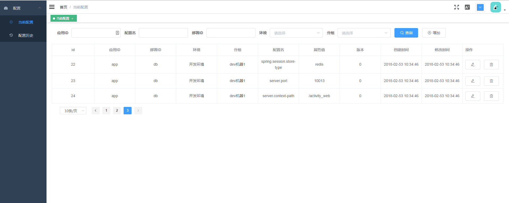

# 安装

dictator分为客户端和服务端两个部分，使用dictator需要安装服务端+集成客户端

## 安装服务端

#### 第一步：获取服务端jar
服务端是一个jar包，你可以直接从源码自己打包，也可以从[GitHub Release](https://github.com/liuyuyu/dictator/releases)下载对应的版本

##### 源码打包
确认自己的电脑已经安装好```git、jdk、maven```之后，按照顺序执行下面的命令
```
git clone https://github.com/liuyuyu/dictator
cd dictator
mvn clean package -Dmaven.test.skip=true
```
文件```./dictator-web/target/dictator-web.jar```就是最终需要的服务端jar

#### 第二步：初始化数据库

从[schema.sql](https://github.com/liuyuyu/dictator/blob/master/sql/schema.sql)获取数据库初始化脚本并执行（只支持MySQL）

#### 第三步：配置zookeeper

dictator基于用zk做内存缓存，使用前需要安装好zk。dictator-web是一个Spring Boot工程，你可以在```application.properties```里修改配置
```xml
dictator.zk.address=localhost:2181 #zookeeper地址
dictator.zk.enable=true #是否启用zookeeper
```
或者使用```java```命令的启动参数配置
```bash
java -jar dictator-web.jar --dictator.zk.enable=true --dictator.zk.address=localhost:2181 
```
到此，服务端完成。
打开浏览器输入```http://localhost:3399```

输入账号密码```admin 123456```
点击登录后跳转到

安装完成！

## 集成客户端

客户端集成暂时只支持Spring/Spring Boot，如果需要其他框架的集成，请在[issue](https://github.com/liuyuyu/dictator/issues/new)说明需求。

### Spring
>需要Spring版本3.1+

以maven工程为例：
在已有Spring工程的```pom.xml```增加依赖
```xml
<dependency>
    <groupId>com.github.liuyuyu</groupId>
    <artifactId>dictator-spring</artifactId>
    <version>${dictator.version}</version>
</dependency>
```
然后在Spring的xml配置文件里增加
```xml
<?xml version="1.0" encoding="UTF-8"?>
<beans xmlns:context="http://www.springframework.org/schema/context"
       xmlns:xsi="http://www.w3.org/2001/XMLSchema-instance"
       xmlns:task="http://www.springframework.org/schema/task"
       xmlns="http://www.springframework.org/schema/beans"
       xmlns:dictator="http://www.github.com/liuyuyu/dictator"
       xsi:schemaLocation="http://www.springframework.org/schema/context
    http://www.springframework.org/schema/context/spring-context.xsd
    http://www.springframework.org/schema/beans
    http://www.springframework.org/schema/beans/spring-beans.xsd
    http://www.springframework.org/schema/task
    http://www.springframework.org/schema/task/spring-task.xsd
    http://www.github.com/liuyuyu/dictator
    http://www.github.com/liuyuyu/dictator.xsd
">
    <context:component-scan base-package="com.example.app"/>
    <task:annotation-driven/> <!-- 为了启动定时拉取配置任务 -->
    <dictator:config/> <!-- 读取dictator.properties文件的配置，初始化dictator入口bean -->
</beans>
```
Spring的集成和Spring Boot的集成都依赖```dictator.properties```的配置。现在需要在工程的```resources```文件夹里创建文件```dictator.properties```,
增加配置
```properties
appId=app # 应用的ID
profile=dev #当前的环境
deploymentId=db #部署的节点ID
serverUrl=http://localhost:3399 #服务端地址
```

### Spring Boot
同样以maven工程为例：在pom.xml增加依赖
```xml
<dependency>
    <groupId>com.github.liuyuyu</groupId>
    <artifactId>dictator-spring-boot-starter</artifactId>
    <version>${dictator.version}</version>
</dependency>
```
增加和Spring集成相同的```dictator.properties```文件。

然后，完成。